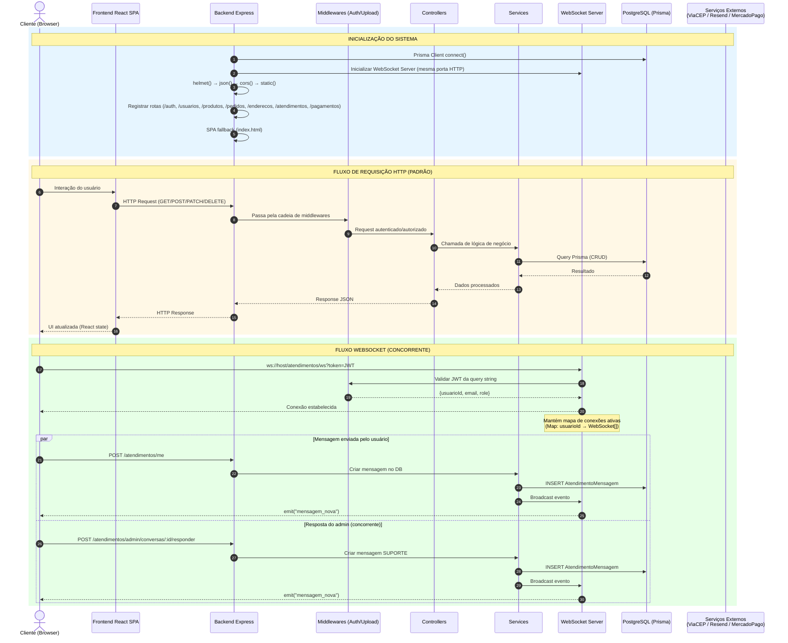
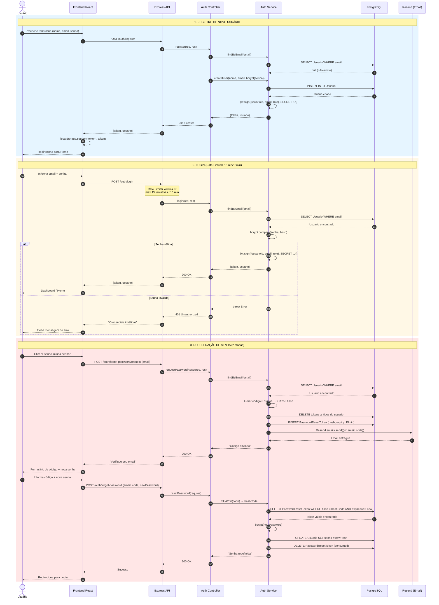
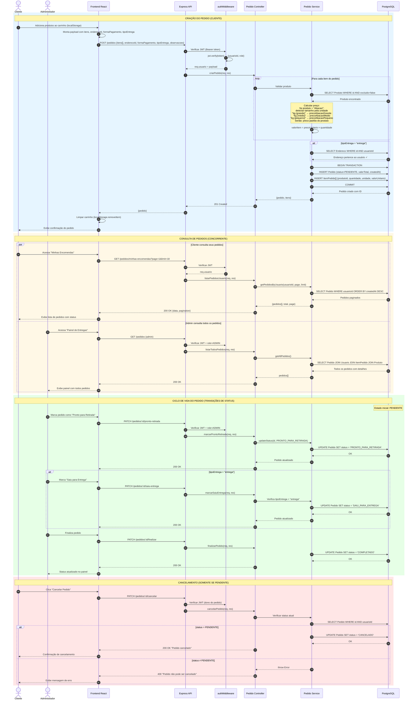
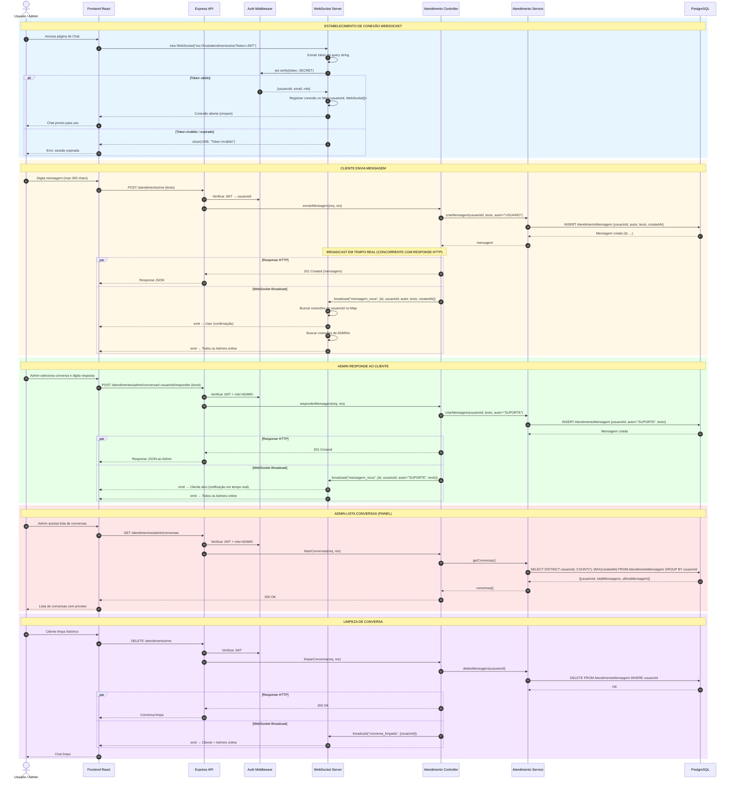
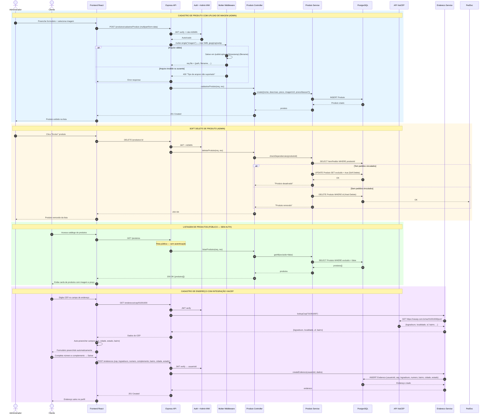

# Diagrama de Sequência UML — Visão de Processo do Sistema

> **Sistema**: Fazenda Bispo — E-commerce Agrícola  
> **Modelo Arquitetural**: 4+1 de Kruchten — Visão de Processo  
> **Data**: Março/2026

## Sumário

1. [Visão Geral de Processo](#1-visão-geral-de-processo)
2. [Fluxo de Autenticação](#2-fluxo-de-autenticação)
3. [Fluxo de Pedidos](#3-fluxo-de-pedidos)
4. [Fluxo de Atendimento em Tempo Real](#4-fluxo-de-atendimento-em-tempo-real-websocket)
5. [Fluxo de Produtos e Integrações Externas](#5-fluxo-de-produtos-endereços-e-integrações-externas)

---

## Componentes Participantes

| Componente             | Tecnologia                               | Responsabilidade                                                             |
| ---------------------- | ---------------------------------------- | ---------------------------------------------------------------------------- |
| **Cliente (Browser)**  | React SPA + React Router                 | Interface do usuário, navegação SPA, estado local (carrinho em localStorage) |
| **Frontend React SPA** | Vite + TailwindCSS + React Query         | Renderização, gerenciamento de estado, chamadas HTTP e WebSocket             |
| **Backend Express**    | Express.js + Node.js                     | Servidor HTTP, roteamento, cadeia de middlewares, servir SPA                 |
| **Middlewares**        | helmet, cors, express-rate-limit, multer | Segurança, CORS, rate limiting, upload de arquivos                           |
| **Auth Middleware**    | jsonwebtoken (JWT)                       | Verificação de token, extração de `{usuarioId, email, role}`                 |
| **Controllers**        | Express handlers                         | Validação de entrada, orquestração de chamadas ao service                    |
| **Services**           | Lógica de negócio pura                   | Regras de negócio, cálculos de preço, comunicação com DB e APIs externas     |
| **WebSocket Server**   | ws (biblioteca nativa)                   | Conexões persistentes, broadcast de eventos em tempo real                    |
| **PostgreSQL**         | Prisma ORM                               | Persistência de dados, transações ACID                                       |
| **ViaCEP**             | API REST externa                         | Consulta de endereços por CEP                                                |
| **Resend**             | API REST externa                         | Envio de emails transacionais (recuperação de senha)                         |

---

## 1. Visão Geral de Processo

Diagrama que apresenta a interação macro entre todos os componentes do sistema, incluindo inicialização, fluxo HTTP padrão e comunicação WebSocket concorrente.



### Aspectos de Concorrência Evidenciados

- **HTTP e WebSocket coexistem** na mesma porta, processando requisições em paralelo via event loop do Node.js.
- **Múltiplos clientes** podem enviar mensagens simultaneamente; o WebSocket Server mantém um `Map<usuarioId, WebSocket[]>` para roteamento.
- **Broadcast assíncrono** ocorre em paralelo com o response HTTP — o cliente recebe tanto a confirmação HTTP quanto a notificação WebSocket.

---

## 2. Fluxo de Autenticação

Detalha os três processos de autenticação: registro, login (com rate limiting) e recuperação de senha (com integração de email).



### Mecanismos de Segurança no Processo

| Mecanismo          | Descrição                                                                    |
| ------------------ | ---------------------------------------------------------------------------- |
| **Rate Limiting**  | Login limitado a 15 tentativas por IP a cada 15 minutos                      |
| **bcrypt**         | Senhas armazenadas com hash bcrypt (salt automático)                         |
| **JWT (1h)**       | Token de acesso com expiração de 1 hora; payload: `{usuarioId, email, role}` |
| **SHA256**         | Código de reset armazenado como hash — código original nunca persiste no DB  |
| **Token de Reset** | Expiração de 15 minutos; tokens anteriores são removidos antes de criar novo |

---

## 3. Fluxo de Pedidos

Processo central do sistema: criação de pedido com validação de estoque, cálculo de preço (incluindo lógica especial para abacaxi), ciclo de vida completo com transições de status, e consultas concorrentes.



### Máquina de Estados do Pedido

```
PENDENTE ──────────────────┬──→ PRONTO_PARA_RETIRADA ──→ SAIU_PARA_ENTREGA ──→ COMPLETADO
   │                       │              │                                         ▲
   │                       │              └──────────── (retirada) ─────────────────┘
   └── CANCELADO           └──→ COMPLETADO (direto, se retirada)
```

| Transição                                | Ator    | Condição                     |
| ---------------------------------------- | ------- | ---------------------------- |
| PENDENTE → PRONTO_PARA_RETIRADA          | Admin   | —                            |
| PRONTO_PARA_RETIRADA → SAIU_PARA_ENTREGA | Admin   | tipoEntrega = "entrega"      |
| SAIU_PARA_ENTREGA → COMPLETADO           | Admin   | —                            |
| PRONTO_PARA_RETIRADA → COMPLETADO        | Admin   | tipoEntrega = "retirada"     |
| PENDENTE → CANCELADO                     | Cliente | Somente se status = PENDENTE |

---

## 4. Fluxo de Atendimento em Tempo Real (WebSocket)

Processo de comunicação bidirecional entre cliente e suporte via WebSocket, com broadcast concorrente de eventos e gerenciamento de conexões ativas.



### Eventos WebSocket

| Evento             | Payload                                    | Destinatários               | Gatilho                          |
| ------------------ | ------------------------------------------ | --------------------------- | -------------------------------- |
| `mensagem_nova`    | `{id, usuarioId, autor, texto, createdAt}` | Usuário dono + todos ADMINs | POST mensagem (usuario ou admin) |
| `conversa_limpada` | `{usuarioId}`                              | Usuário dono + todos ADMINs | DELETE conversa                  |

### Modelo de Concorrência

- O WebSocket Server mantém um **Map** de conexões ativas indexado por `usuarioId`.
- Cada usuário pode ter **múltiplas conexões simultâneas** (ex.: múltiplas abas).
- O broadcast itera sobre todas as conexões registradas — se um admin tem 3 abas abertas, as 3 recebem o evento.
- As operações de **persistência (DB)** e **broadcast (WS)** ocorrem de forma **concorrente** após o processamento da mensagem.

---

## 5. Fluxo de Produtos, Endereços e Integrações Externas

Processos de gestão de catálogo (com upload de imagem e soft delete), consulta pública de produtos, e integração com API ViaCEP para autopreenchimento de endereços.



### Integrações Externas

| Serviço          | Protocolo        | Uso                                                | Tratamento de Falha                                          |
| ---------------- | ---------------- | -------------------------------------------------- | ------------------------------------------------------------ |
| **ViaCEP**       | HTTP GET (REST)  | Consulta de endereço por CEP                       | Retorna erro ao cliente se API indisponível                  |
| **Resend**       | HTTP POST (REST) | Envio de email de recuperação de senha             | Em dev: código retornado no response HTTP                    |
| **Mercado Pago** | —                | Schema preparado (`PagamentoPix`), integração stub | Formas de pagamento: PIX e DINHEIRO (sem processamento real) |

---

## Resumo da Visão de Processo

### Processos Principais em Tempo de Execução

| Processo                      | Tipo                    | Protocolo                | Concorrência                              |
| ----------------------------- | ----------------------- | ------------------------ | ----------------------------------------- |
| Autenticação (login/register) | Síncrono                | HTTP REST                | Independente por requisição               |
| Recuperação de senha          | Síncrono + Assíncrono   | HTTP + Email (Resend)    | Token com expiração temporal              |
| Criação de pedido             | Síncrono + Transacional | HTTP + SQL Transaction   | Validação sequencial de itens             |
| Gestão de status do pedido    | Síncrono                | HTTP REST                | Máquina de estados com guarda             |
| Chat / Atendimento            | Síncrono + Assíncrono   | HTTP + WebSocket         | Broadcast concorrente, múltiplas conexões |
| Upload de imagem              | Síncrono                | HTTP multipart/form-data | Processamento sequencial (multer)         |
| Consulta ViaCEP               | Síncrono + Externo      | HTTP proxy → API REST    | Dependência de serviço externo            |

### Fluxo de Dados Entre Camadas

```
┌─────────────┐     HTTP/WS      ┌──────────────┐    Prisma ORM    ┌────────────┐
│  Frontend    │ ◄──────────────► │   Backend    │ ◄──────────────► │ PostgreSQL │
│  React SPA   │                  │   Express    │                  │            │
└─────────────┘                  └──────┬───────┘                  └────────────┘
                                        │ HTTP
                                        ▼
                                 ┌──────────────┐
                                 │  APIs Externas│
                                 │  ViaCEP      │
                                 │  Resend      │
                                 └──────────────┘
```
